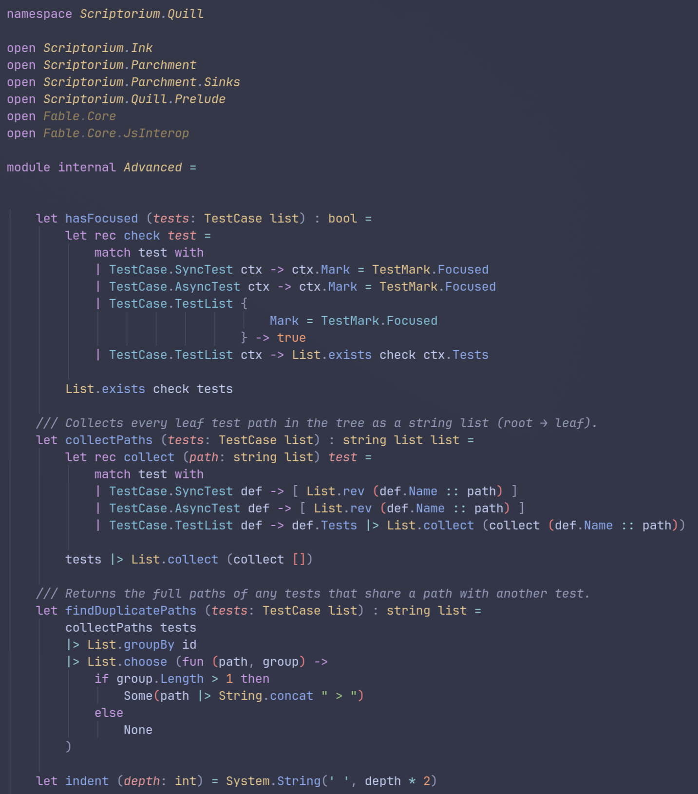

# Tree Sitter for F#

An F# grammar for [tree-sitter](https://tree-sitter.github.io/), tuned
for use inside the [Helix editor](https://helix-editor.com/).

> [!NOTE]
> For neovim support you can use [Ionide Tree Sitter](https://github.com/ionide/tree-sitter-fsharp)
>
> If you prefer to use the grammar from this repo for neovim, PRs are welcome



## Why this grammar

**Coverage is measured, not hoped for.** Every change is gated on a benchmark
of real-world F#: 23 popular open-source projects (Fable, Paket, FAKE,
FSharpPlus, FSharp.Data, Hopac, Giraffe, Saturn, Feliz, …) plus the
`dotnet/fsharp` compiler sources — about **3 900 files / 840 000 lines**.
Current standing:

| Suite | Files parsing without a single error |
|---|---|
| 23-project benchmark (3 654 files) | **95.3 %** |
| `dotnet/fsharp` compiler + FSharp.Core (260 files) | **89.2 %** |

and the files that do fail mostly carry 1–3 tiny error nodes rather than
broken highlighting — across both suites the error density is roughly **one
error node per 800 lines**. No fix lands if it makes any benchmarked file
worse.

**Modern F# is covered.** A systematic battery against the F# language
reference parses everything from units of measure and active patterns to the
newest additions: F# 9 nullness annotations (`string | null`), IWSAMs /
static abstract members, `_.Name` shorthand lambdas, `while!`, anonymous
records (incl. `struct {| … |}`), string-interpolation variants,
fsyacc/fslex line directives, and FSharp.Core's own inline-IL and
static-optimization syntax.

**The offside rule is implemented in a real scanner.** F#'s indentation
semantics (arm alignment, undentation grace for infix operators, `#if/#else`
inactive branches as trivia, nested block comments) live in a hand-written
external scanner modeled on the F# compiler's own LexFilter behaviour. When
something does fail to parse, the damage stays local to the construct
instead of cascading through the rest of the file.

**Tuned for Helix.** The queries (`highlights.scm`, `locals.scm`,
`rainbows.scm`, …) are written and tested against Helix's capture
conventions — parameters, operators, doc comments and preprocessor regions
all color the way you'd expect, and `examples/layout.fsx` is a living
showcase you can open to eyeball every supported construct at once.

**Regression-proofed.** 466 corpus tests, one per construct, each storing
the exact expected parse tree.

## Installation

There are two paths depending on whether you want to **try the grammar**
or **work on it**.

In `~/.config/helix/languages.toml`:

```toml
[[grammar]]
name = "fsharp"
source = { git = "https://github.com/MangelMaxime/tree-sitter-fsharp", rev = "main" }
```

Then:

```bash
hx --grammar fetch    # clone the grammar
hx --grammar build    # compile it
```

Install the queries (Helix doesn't auto-install them). One-liner:

```bash
curl -fsSL https://raw.githubusercontent.com/MangelMaxime/tree-sitter-fsharp/main/scripts/install-queries.sh | bash
```

Or pin to a branch / commit (make sure to use the same rev as in `languages.toml`):

```bash
curl -fsSL https://raw.githubusercontent.com/MangelMaxime/tree-sitter-fsharp/main/scripts/install-queries.sh | bash -s -- some-branch
```

The script above copies the queries into `~/.config/helix/runtime/queries/fsharp/` or `$HELIX_RUNTIME/queries/fsharp/` if you have a custom runtime directory.

## Uninstall

The installation touches two places: the compiled grammar (managed by
Helix) and the query files (copied by the script above). Both live under
Helix's runtime directory — `~/.config/helix/runtime` by default, or
`$HELIX_RUNTIME` if you set a custom one. Remove both:

```bash
RUNTIME="${HELIX_RUNTIME:-$HOME/.config/helix/runtime}"

# 1. Remove the queries installed by the script
rm -rf "$RUNTIME/queries/fsharp"

# 2. Remove the compiled grammar + its cloned source
rm -f  "$RUNTIME/grammars/fsharp.so"
rm -rf "$RUNTIME/grammars/sources/fsharp"
```

Then drop the `[[grammar]]` and `[[language]]` `fsharp` entries you added to `~/.config/helix/languages.toml`.

After that, Helix falls back to its built-in F# grammar (if any) on the next launch.

## Development workflow

1. Edit `grammar.js` and/or `src/scanner.c`.
2. `npx tree-sitter generate` (or just `./dev.sh`).
3. `npx tree-sitter test` to confirm the corpus (460+ tests) still passes.
4. `npx tree-sitter parse examples/layout.fsx | grep -c ERROR` - should be zero.
5. `./dev.sh` to deploy to Helix.
6. Restart Helix and check the highlights.

For UI-visible changes, render with `tree-sitter highlight`:

```bash
npx tree-sitter highlight path/to/your/file.fsx
```

That shows you the ANSI-tinted output exactly as the queries would apply
in Helix's default theme. It's the fastest way to sanity-check that a
queries change does what you expect before reloading Helix.

## Editor configuration

Here is my recommended `languages.toml` config for F# support in Helix.

```toml
[language-server.fsharp-ls]
args = [
  "--adaptive-lsp-server-enabled",
  "--project-graph-enabled",
  "--use-fcs-transparent-compiler"
]
environment.FCS_ParallelReferenceResolution = "true"
environment.DOTNET_GCServer = "1"
environment.DOTNET_GCHeapCount = "c"

[language-server.fsharp-ls.config]
AutomaticWorkspaceInit = true
FSharp.unnecessaryParenthesesAnalyzer = false
FSharp.ExternalAutocomplete = false
FSharp.fsac.cachedTypecheckCount = 400
FSharp.addPrivateAccessModifier = true
FSharp.UnusedOpensAnalyzer = true
FSharp.UnusedDeclarationsAnalyzer = true
FSharp.InterfaceStubGeneration = true
FSharp.AbstractClassStubGeneration = true
FSharp.UnionCaseStubGeneration = true
FSharp.RecordStubGeneration = true
FSharp.TooltipShowDocumentationLink = false
# FSharp.generateBinlog = true

[[language]]
name = "fsharp"
auto-format = false
comment-tokens = ["//", "///"] # Will be the default in next Helix release

[language.auto-pairs]
# Remove auto pairs for single quotes, as they are often used for type annotations in F#
'(' = ')'
'[' = ']'
'{' = '}'
'"' = '"'
# '[<' = ']>' # Helix doesn't support multi-character pairs yet, but it would be nice to have this for F#'s attributes

[[grammar]]
name = "fsharp"
source = { git = "https://github.com/MangelMaxime/tree-sitter-fsharp", rev = "main" }
```

If you also want rainbow brackets (the grammar ships `rainbows.scm`), add this to your `config.toml`:

```toml
[editor]
rainbow-brackets = true
```

> [!NOTE]
> At the time of writing, you need to build Helix from source to get rainbow brackets support

## Testing

The test corpus lives in `test/corpus/*.txt` - one file per topic,
multiple named tests per file. Each test is an F# snippet plus the
expected parse-tree shape.

```bash
npx tree-sitter test                  # run everything
npx tree-sitter test -i some_test     # match by name (substring)
```

### Expansion tests

Helix's expand-selection walks the parse tree's node *extents* — something
the corpus tests can't assert (they compare structure only). The fixtures in
`test/expansion/*.txt` pin the exact selection text of each expansion step
from a `‸` cursor marker:

```bash
python3 scripts/test-expansion.py             # run all
python3 scripts/test-expansion.py -i multiDoc # filter by substring
```

## Licence

Apache 2.0
